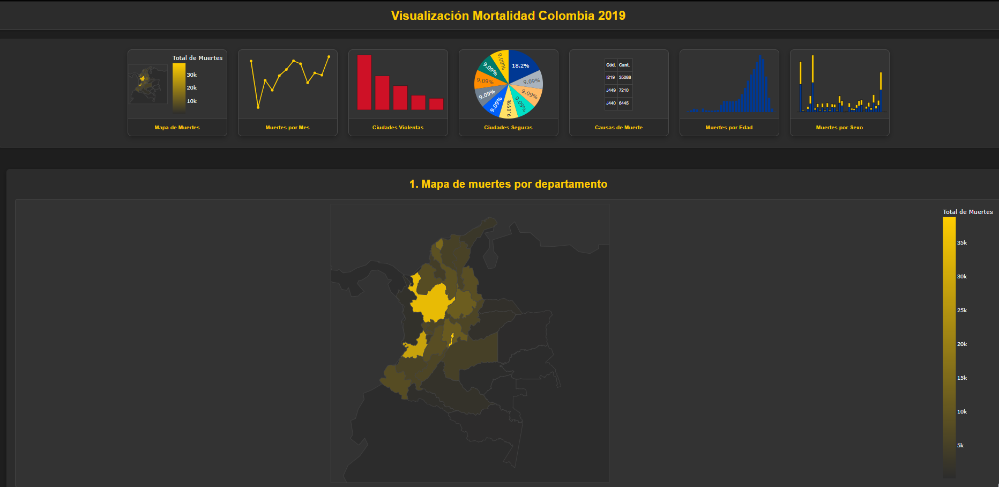

# Visualización Interactiva de Datos de Mortalidad en Colombia (2019)



## Descripción General
Este proyecto presenta un dashboard interactivo desarrollado con Dash y Plotly en Python para visualizar y analizar los datos de mortalidad no fetal en Colombia correspondientes al año 2019. La aplicación ofrece múltiples perspectivas gráficas, incluyendo mapas coropléticos, series de tiempo, gráficos de barras y tablas, permitiendo a los usuarios explorar tendencias y patrones en los datos de mortalidad a nivel nacional, departamental y municipal.

El dashboard está diseñado con una interfaz de usuario moderna y temática oscura, con acentos inspirados en los colores de Colombia, buscando ofrecer una experiencia de usuario agradable y profesional.

## Características Principales
- **Navegación Intuitiva**: Un panel de previsualización permite acceder rápidamente a las diferentes secciones del dashboard.
- **Tema Oscuro Personalizado**: Interfaz con una paleta de colores oscura y acentos inspirados en Colombia para una mejor estética y reducción de la fatiga visual.
- **Interactividad**: Gráficos con tooltips informativos al pasar el cursor y capacidades de zoom/paneo.

### Visualizaciones Detalladas:
- **Mapa de Muertes por Departamento**: Distribución geográfica de la mortalidad.
- **Total de Muertes por Mes**: Tendencia temporal de la mortalidad a lo largo de 2019.
- **5 Ciudades Más Violentas (Homicidios)**: Identificación de municipios con mayor número de homicidios.
- **10 Ciudades con Menor Mortalidad**: Municipios con los menores índices de mortalidad general.
- **Top 10 Causas de Muerte**: Clasificación de las principales causas de defunción (presentada en tabla).
- **Histograma de Muertes por Edad**: Distribución de la mortalidad por grupos quinquenales de edad.
- **Muertes por Sexo en cada Departamento**: Comparativa de mortalidad por sexo a nivel departamental.

- **Desarrollado en Python**: Utilizando Dash, Plotly y Pandas para la manipulación y visualización de datos.

## Estructura del Proyecto
```
MORTALIDAD_COLOMBIA/
├── .venv/                      # Entorno virtual (no versionado)
├── assets/
│   └── style.css               # Hoja de estilos CSS para la personalización visual
├── data/
│   ├── Anexo1.NoFetal2019_CE_15-03-23.xlsx
│   ├── Anexo2.CodigosDeMuerte_CE_15-03-23.xlsx
│   ├── Anexo3.Divipola_CE_15-03-23.xlsx
│   └── departamentos_colombia__plotly.geojson
├── screenshots/
│   └── dashboard_vista_general.png
├── Procfile
├── app.py
├── README.md
├── requirements.txt
└── .gitignore
```

## Fuentes de Datos
Los datos utilizados en este proyecto provienen de los siguientes archivos (ubicados en la carpeta `/data`):
- Anexo1.NoFetal2019_CE_15-03-23.xlsx
- Anexo2.CodigosDeMuerte_CE_15-03-23.xlsx
- Anexo3.Divipola_CE_15-03-23.xlsx
- departamentos_colombia__plotly.geojson

## Tecnologías Utilizadas
- Python 3.x
- Dash
- Plotly & Plotly Express
- Pandas
- Gunicorn
- Openpyxl
- HTML/CSS

## Configuración y Ejecución Local

```bash
git clone https://github.com/Milio-Dev-16/dashboard-mortalidad-colombia-2019.git
cd MORTALIDAD_COLOMBIA

python -m venv .venv
# Activar entorno:
# Windows: .venv\Scripts\activate
# macOS/Linux: source .venv/bin/activate

pip install -r requirements.txt

python app.py
```

Accede a: [http://127.0.0.1:8050/](http://127.0.0.1:8050/)

## Despliegue en Render

https://dashboard-mortalidad-colombia-2019.onrender.com/sexo

## Autor
Emilio Velandia

## Licencia


